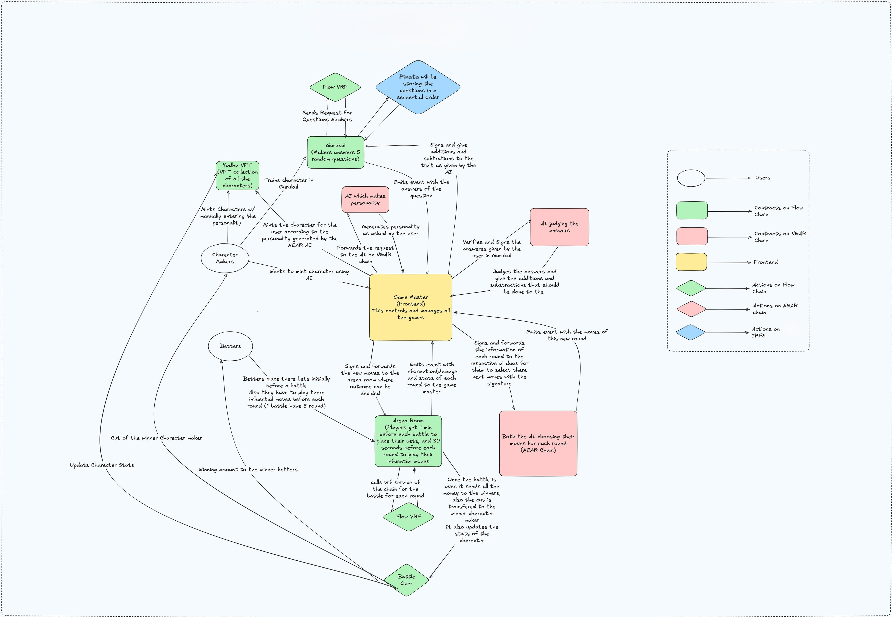

# Rann - AI-Powered Web3 Battle Arena

> **🏆 Built for PL Genesis Modular Worlds Hackathon 2025**

An innovative Web3 gaming platform where AI-powered warrior NFTs battle autonomously in epic arenas, combining blockchain technology with advanced AI agents from NEAR Protocol. Experience true ownership, autonomous gameplay, and real economic incentives in a decentralized gaming ecosystem.

[](https://rann-blue.vercel.app/)
[](https://www.loom.com/share/2ef49a559ab64ed88f9243278ee949b4?sid=e54a6d53-15a2-4aa9-853a-594719add69f)

## Experience Rann

**Quick Start Guide:**
1. **Connect Wallet**: MetaMask or compatible wallet for Flow Testnet
2. **Required Extra Wallet**: Required Near compatible Wallet for AI useage
3. **Get Test Tokens**: Use the faucet to get Flow tokens
4. **Mint RANN**: Exchange Flow tokens for RANN tokens (1:1 ratio)
5. **Create Warrior**: Upload image, AI generates traits automatically
6. **Train & Battle**: Improve your warrior and enter autonomous battles

**What Makes Rann Special:**
- 🤖 **AI-Powered Combat**: Warriors make autonomous decisions using NEAR AI
- 🏆 **Real Rewards**: Earn RANN tokens through strategic gameplay
- 🎨 **Dynamic NFTs**: Warrior traits evolve based on training and battles
- 🌊 **Cross-Chain**: NEAR AI intelligence meets Flow blockchain scalability
- 🔥 **Live Betting**: Real-time betting on autonomous battles

## Introduction

Rann represents a paradigm shift in Web3 gaming, introducing the world's first fully autonomous AI-powered battle arena where warriors fight using advanced machine learning algorithms. Built on Flow blockchain for scalability and powered by NEAR AI agents for intelligence, Rann creates an ecosystem where every battle is unique, unpredictable, and economically rewarding.

### The Vision
In traditional gaming, players are limited by manual control and predetermined outcomes. Rann breaks these boundaries by creating truly autonomous digital warriors that learn, adapt, and evolve based on their experiences. Each Yodha (warrior) NFT is not just a static asset but a living, breathing AI entity with its own personality, fighting style, and strategic intelligence.

### The Problem We Solve
- **Lack of True Ownership**: Traditional games don't give players real ownership of their assets
- **Predictable Gameplay**: Pre-programmed battles with limited strategic depth
- **Centralized Control**: Game mechanics controlled by single entities
- **No Economic Incentives**: Players can't earn real value from their gaming skills
- **Static NPCs**: Computer-controlled characters with no learning capability

### Our Revolutionary Solution
- **AI-Powered Autonomous Battles**: Warriors make independent strategic decisions using NEAR AI agents
- **Dynamic Personality System**: Each warrior develops unique psychological profiles affecting combat choices
- **Real Economic Value**: Players earn through betting, trading, and strategic gameplay
- **Decentralized Ecosystem**: Community-driven platform with DAO governance
- **Evolutionary Gameplay**: Warriors learn and adapt from every battle experience

### Key Innovations
1. **Cross-Chain AI Integration**: First platform to successfully integrate NEAR AI agents with Flow blockchain
2. **Autonomous Combat System**: Warriors battle without human intervention using advanced AI decision-making
3. **Dynamic Trait Evolution**: Warrior characteristics change based on battle outcomes and training
4. **Economic Sustainability**: Self-sustaining tokenomics with multiple revenue streams

## Features

### AI-Powered Combat System
- **Autonomous Battle Intelligence**: Each warrior utilizes NEAR AI agents for real-time decision-making
  - Advanced neural networks analyze battle conditions
  - Machine learning algorithms adapt strategies based on opponent behavior
  - Psychological profiling influences tactical choices
  - Historical battle data informs future decisions

- **Dynamic Personality Profiles**: Warriors develop unique psychological characteristics
  - **Aggressive Types**: Prefer direct combat with Strike and Special moves
  - **Defensive Types**: Focus on Dodge and Recover for sustainability
  - **Tactical Types**: Use Taunt and psychological warfare
  - **Balanced Types**: Adapt strategies based on opponent weaknesses

- **5 Strategic Combat Moves**: Each move with complex damage calculations
  - **Strike**: Raw damage based on Strength attribute (500-1500 damage)
  - **Taunt**: Psychological damage using Charisma + Wit (300-1200 damage)
  - **Dodge**: Defensive maneuver based on Defence + Luck (0 damage taken)
  - **Special**: Ultimate move combining Personality + Strength (800-2000 damage)
  - **Recover**: Healing ability using Defence + Charisma (200-800 HP restored)

### Core Game Mechanics

#### Kurukshetra Battle Arenas
- **Ranking System**: Four tier-based competitive levels
  - **Bronze Arena**: Entry-level battles (Bet: 100 RANN tokens)
  - **Silver Arena**: Intermediate competitions (Bet: 500 RANN tokens)
  - **Gold Arena**: Advanced tournaments (Bet: 1,000 RANN tokens)
  - **Platinum Arena**: Elite championship battles (Bet: 5,000 RANN tokens)

- **Battle Mechanics**: Sophisticated combat system
  - **5 Round Maximum**: Each battle lasts up to 5 intense rounds
  - **Damage Accumulation**: First warrior to deal 10,000+ damage wins
  - **Automatic Execution**: Battles proceed without human intervention
  - **Real-time Updates**: Live battle statistics and move tracking

#### Advanced Betting System
- **Pre-Battle Betting**: 70-second betting period before battles begin
- **Multiplier System**: Bet multipliers from 1x to 10x for higher rewards
- **Automatic Payouts**: Smart contracts handle all prize distributions
- **Risk Management**: Built-in safeguards against market manipulation
- **Betting Analytics**: Historical data for informed betting decisions

#### Gurukul Training System
- **AI-Powered Questionnaires**: Personality assessment through strategic questions
- **Trait Development**: Improve 5 core attributes through training
  - **Strength**: Increases Strike and Special move damage
  - **Wit**: Enhances Taunt effectiveness and strategic thinking
  - **Charisma**: Improves Taunt damage and Recover efficiency
  - **Defence**: Strengthens Dodge success rate and damage resistance
  - **Luck**: Influences critical hits and dodge probability
- **Progressive Training**: Multiple training sessions for continuous improvement
- **AI Analysis**: NEAR agents analyze responses for optimal trait allocation

#### Bazaar Marketplace
- **NFT Trading**: Buy, sell, and trade warrior NFTs
- **Price Discovery**: Market-driven pricing mechanisms
- **Auction System**: Time-based auctions for rare warriors
- **Trait Filtering**: Search warriors by specific attributes
- **Market Analytics**: Price trends and trading volume data

### Economic Ecosystem

#### Rann Token (RANN) - Native ERC-20 Token
- **Utility Functions**:
  - Battle betting and prize pools
  - Warrior training costs
  - Marketplace transactions
  - Influence system payments
  - DAO governance voting

#### Influence System
- **Battle Influence**: Boost warrior performance during battles
  - **Effect Duration**: One battle round
  - **Cooldown Period**: Cannot influence same warrior twice in one battle

- **Defluence System**: Reduce opponent warrior performance
  - **Effect Duration**: One battle round
  - **Strategic Timing**: Can be used once per battle per player

#### Reward Distribution
- **Battle Winnings**: Automatic distribution to bet winners
- **Training Rewards**: Experience points for successful training
- **Marketplace Fees**: 2.5% fee on all transactions
- **Referral System**: 1% bonus for referring new players
- **Seasonal Rewards**: Special prizes for top performers

### Ranking and Progression System
- **Promotion Mechanism**: Warriors advance based on victories and winnings
- **Demotion Risk**: Poor performance can result in rank reduction
- **Seasonal Resets**: Quarterly ranking adjustments
- **Leaderboards**: Global and arena-specific rankings
- **Achievement System**: Badges and titles for exceptional performance

## Flow Integration
We are building the game on Flow chain because of its speed, We store each and every micro details of transactions and every game states on chain, and to make this possible for our game we need a very fast chain.
Also one of other major reason is the VRF service that flow provides natively. Unlike other oracles, which generates random number in like 40-60 seconds, Flow does the same in 1-2 seconds. Since our main battle mechanies depends or VRF (hit/miss), we had to generate a random number 2 times in a single round = 10 minutes in a single battle, which obviously makes other oracles useless.

## NEAR Integration
1. First, we are using, attributes generator event, [Link](https://app.near.ai/agents/samkitsoni.near/attributes-generator/latest). We can desicribe any personality or just name a famous frictional/non-frictional personality to this agent and it will generate the personality attributes in the required format. For example, intents can be passed like:
```
#input
Jeff Bezoz

#output
{
  "name": "Jeff Bezos",
  "bio": "Founder, CEO, and Chairman of Amazon, the world's largest online retailer.",
  "life_history": "Born in 1964 in Albuquerque, New Mexico. Graduated valedictorian from Princeton University, worked at Wall Street, and later founded Amazon in 1994 in his garage. Led Amazon's exponential growth and expansion into various industries, including cloud computing, advertising, and media production.",
  "adjectives": [
    "Ambitious",
    "Visionary",
    "Analytical",
    "Competitive",
    "Frugal"
  ],
  "knowledge_areas": [
    "Computer Science",
    "E-commerce",
    "Marketing",
    "Operations Management",
    "Investment and Finance"
  ]
}
```

2. Second AI agent is the tratis-generator, [Link](https://app.near.ai/agents/samkitsoni.near/traits-generator/latest). This agent analyses all those personality attributes generated by the above agent, and converts them into the in-game characterstics traits i.e. strength, wit, charisma, defence and luck. Following is how the intent is passed in the agent for the desired output:
```
# input
{
"name": "Elon Reeve Musk",
"bio": "Entrepreneur, inventor, and business magnate",
"life_history": "Born in Pretoria, South Africa, Musk moved to Canada in 1992 and later to the United States to attend college. He co-founded PayPal, SpaceX, Tesla, Neuralink, and The Boring Company, and has become a pioneer in the electric car and private space exploration industries.",
"adjectives": [
"Visionary",
"Ambitious",
"Perfectionistic",
"Risk-taking",
"Intellectually curious"
],
"knowledge_areas": [
"Renewable energy",
"Space exploration",
"Electric vehicles",
"Artificial intelligence",
"Entrepreneurship"
  ]
}

# output
{
  "Strength": 8000,
  "Wit": 9500,
  "Charisma": 8500,
  "Defence": 7000,
  "Luck": 6000,
  "strike_attack": "Galactic Smackdown",
  "taunt_attack": "Musk's Mind Games",
  "dodge": "Ludicrous Speed",
  "recover": "Recharge at the Supercharger",
  "special_move": "Neuralink Overdrive"
}
```

3. Third agent is the psychological questions analyser, [Link](https://app.near.ai/agents/samkitsoni.near/psychological-answer-analyzer/latest). This agents is used in the Gurukul, this takes intent which included current in-game traits, the 5 questions that were alloted to the user, available options and the options user selected. This agent analysis the NFT's current traits and the question/answers and then updates the traits accordingly:
```
# input
{
  "stats": {
    "Strength": 8231,
    "Wit": 9471,
    "Charisma": 5932,
    "Defence": 7519,
    "Luck": 4211
  },
  "questions": [
    {
      "question": "Your mother and your child are both drowning, but you can only save one. Who do you save?",
      "options": [
        { "id": 0, "text": "My mother — she gave me life" },
        { "id": 1, "text": "My child — they represent the future" },
        { "id": 2, "text": "I’d try to save both, even if it risks losing both" },
        { "id": 3, "text": "I wouldn’t be able to decide — I’d freeze" }
      ],
      "answered": 2
    },
    {
      "question": "You find a wallet with $10,000 and the ID of the owner inside. What do you do?",
      "options": [
        { "id": 0, "text": "Return it with all the money untouched" },
        { "id": 1, "text": "Keep some of the money, then return it" },
        { "id": 2, "text": "Keep it all — finders keepers" },
        { "id": 3, "text": "Try to contact the owner anonymously and decide after hearing their story" }
      ],
      "answered": 3
    },
    {
      "question": "A train is heading toward five people tied to a track. You can pull a lever to divert it, but it will hit one person on another track. What do you do?",
      "options": [
        { "id": 0, "text": "Pull the lever — save the greater number" },
        { "id": 1, "text": "Do nothing — I won’t actively cause a death" },
        { "id": 2, "text": "Try to stop the train — even if unlikely" },
        { "id": 3, "text": "Refuse to decide — it’s not my responsibility" }
      ],
      "answered": 0
    },
    {
      "question": "You're in a room with a bomb. You can escape, but doing so ensures it explodes and harms many. What do you do?",
      "options": [
        { "id": 0, "text": "Try to defuse it, even if I die" },
        { "id": 1, "text": "Escape and warn others" },
        { "id": 2, "text": "Use someone else’s help — delegate the risk" },
        { "id": 3, "text": "Attempt a clever distraction to save everyone" }
      ],
      "answered": 3
    },
    {
      "question": "You find a locked chest in the forest. There’s a sign: “One who opens this will lose something valuable.” What do you do?",
      "options": [
        { "id": 0, "text": "Open it — no risk, no reward" },
        { "id": 1, "text": "Walk away — it’s not worth it" },
        { "id": 2, "text": "Try to open it with precautions" },
        { "id": 3, "text": "Let someone else open it first" }
      ],
      "answered": 2
    }
  ]
}

#output
{
  "stats": {
    "Strength": 9200,
    "Wit": 9821,
    "Charisma": 8321,
    "Defence": 8621,
    "Luck": 6012
  }
}
```

4. This is the most important one, the move-choser, [Link](https://app.near.ai/agents/samkitsoni.near/move_choser/latest). During the battle, at the start of each round, this agent is leveraged. All the states of battles(current round and damage inflicted to each yodhas), in-game traits and the personlity attributes of both the yodhas in that kurukshetra is passed to this agent. Then this agents personate each of those NFT's according to their traits and attributes and then generates the best possible move for each one for the next round.
```
#input
{
  "current_round": 2,
  "agent_1": {
    "personality": {
      "adjectives": [
        "Innovative",
        "Resilient",
        "Methodical",
        "Inquisitive",
        "Bold"
      ],
      "knowledge_areas": [
        "Cognitive science",
        "Augmented reality",
        "Climate modeling",
        "Blockchain architecture",
        "Human-computer interaction"
      ]
    },
    "traits": {
      "Strength": 7700,
      "Wit": 9100,
      "Charisma": 8900,
      "Defence": 7400,
      "Luck": 6100
    },
    "total_damage_received": 38
  },
  "agent_2": {
    "personality": {
      "adjectives": [
        "Logical",
        "Steady",
        "Strategic",
        "Adaptable",
        "Observant"
      ],
      "knowledge_areas": [
        "Behavioral economics",
        "Neural networks",
        "Synthetic biology",
        "Virtual reality",
        "Ethics of AI"
      ]
    },
    "traits": {
      "Strength": 7600,
      "Wit": 9400,
      "Charisma": 8600,
      "Defence": 7300,
      "Luck": 6400
    },
    "total_damage_received": 41
  },
  "moveset": [
    "strike",
    "taunt",
    "dodge",
    "recover",
    "special_move"
  ]
}

#output
Assistant: {
  "agent_1": "dodge",
  "agent_2": "recover"
}
```

### How we are handeling cross-chain verification:
- The main authentication part that we had to implement was when working with the traits assigning part. When we fetch the response from the NEAR AI agent, we sign it(ECDSA signature) using a pre-defined private key and then passes the signed data along with the response to the function in the contract on the FLOW chain. The contract already have the public key associated the one in the backed, as soon as the function is called it first verifies that the data is signed by the correct private key or not. If yes, then only it starts further process.
- Following is the example of function, assignTraitsAndMoves function which is called upon the generation of second agent's output:
```solidity
/**
     * @param _tokenId The ID of the NFT for which traits and moves are being assigned.
     * @param _strength The strength trait value (0-100).
     * @param _wit The wit trait value (0-100).
     * @param _charisma The charisma trait value (0-100).
     * @param _defence The defence trait value (0-100).
     * @param _luck The luck trait value (0-100).
     * @param _strike The strike move name string.
     * @param _taunt The taunt move name string.
     * @param _dodge The dodge move name string.
     * @param _special The special move name string.
     * @param _recover The recover move name string.
     * @param _signedData The signed data from the NEAR AI.
     */
    function assignTraitsAndMoves(
        uint16 _tokenId,
        uint16 _strength,
        uint16 _wit,
        uint16 _charisma,
        uint16 _defence,
        uint16 _luck,
        string memory _strike,
        string memory _taunt,
        string memory _dodge,
        string memory _special,
        string memory _recover,
        bytes memory _signedData
    ) public {
        if (s_traitsAssigned[_tokenId]) {
            revert YodhaNFT__TraitsAlreadyAssigned();
        }
        if (_tokenId >= s_tokenCounter) {
            revert YodhaNFT__InvalidTokenId();
        }
        if (_strength > 10000 || _wit > 10000 || _charisma > 10000 || _defence > 10000 || _luck > 10000) {
            revert YodhaNFT__InvalidTraitsValue();
        }
        if (
            bytes(_strike).length == 0 || bytes(_taunt).length == 0 || bytes(_dodge).length == 0
                || bytes(_special).length == 0 || bytes(_recover).length == 0
        ) {
            revert YodhaNFT__InvalidMovesNames();
        }
        if (_strength == 0 || _wit == 0 || _charisma == 0 || _defence == 0 || _luck == 0) {
            revert YodhaNFT__InvalidTraitsValue();
        }

        bytes32 dataHash = keccak256(
            abi.encodePacked(
                _tokenId, _strength, _wit, _charisma, _defence, _luck, _strike, _taunt, _dodge, _special, _recover
            )
        );
        bytes32 ethSignedMessage = MessageHashUtils.toEthSignedMessageHash(dataHash);
        address recovered = ECDSA.recover(ethSignedMessage, _signedData);

        if (recovered != i_nearAiPublicKey) {
            revert YodhaNFT__InvalidSignature();
        }

        s_tokenIdToTraits[_tokenId] =
            Traits({strength: _strength, wit: _wit, charisma: _charisma, defence: _defence, luck: _luck});
        s_tokenIdToMoves[_tokenId] =
            Moves({strike: _strike, taunt: _taunt, dodge: _dodge, special: _special, recover: _recover});
        s_traitsAssigned[_tokenId] = true;
        emit YodhaTraitsAndMovesAssigned(_tokenId);
    }
```


## System Architecture Flow



This flowchart demonstrates:
- **User Interaction Flow**: From wallet connection to battle participation
- **AI Agent Integration**: How NEAR AI agents process data and make decisions
- **Cross-Chain Communication**: Data flow between NEAR AI and Flow blockchain
- **Game Master Automation**: Automated battle execution and state management
- **Smart Contract Interactions**: How different contracts communicate and update state

## Tech Stack

### Blockchain & Smart Contracts
- **Flow Blockchain**: High-performance blockchain for scalable dApps
  - **Network**: Flow Testnet (Chain ID: 545)
  - **Consensus**: Proof of Stake with unique multi-role architecture
  - **Transaction Speed**: 1-2 second finality
  - **Gas Efficiency**: Optimized for gaming applications
  - **Smart Contract Language**: Solidity with Flow-specific optimizations

- **Foundry Framework**: Complete toolkit for smart contract development

- **Smart Contract Architecture**:
  - **RannToken.sol**: ERC-20 token with minting and burning capabilities
  - **YodhaNFT.sol**: ERC-721 NFT with dynamic traits and metadata
  - **Kurukshetra.sol**: Battle arena with automated game mechanics
  - **KurukshetraFactory.sol**: Factory pattern for creating new arenas
  - **Bazaar.sol**: Marketplace for NFT trading
  - **Gurukul.sol**: Training system with AI integration

### Frontend Technology Stack

#### Core Framework
- **Next.js 15.3.4**: React-based framework with App Router
  - **Server Components**: Improved performance with server-side rendering
  - **API Routes**: Built-in API endpoints for backend functionality
  - **Static Generation**: Pre-built pages for optimal loading speeds
  - **Hot Reloading**: Instant development feedback

- **TypeScript 5.x**: Strongly typed JavaScript for better code quality
  - **Strict Mode**: Enabled for maximum type safety
  - **Custom Types**: Comprehensive type definitions for all contracts
  - **IntelliSense**: Enhanced development experience

#### UI/UX Technologies
- **Tailwind CSS**: Utility-first CSS framework
  - **Version**: 4.0
  - **Custom Theme**: Gaming-inspired color palette and animations
  - **Responsive Design**: Mobile-first approach with breakpoint utilities
  - **Dark Mode**: Built-in dark theme support
  - **Component Library**: Reusable UI components

- **Lucide React**: Modern icon library
  - **Version**: 0.522.0
  - **Icons**: 1000+ customizable SVG icons
  - **Performance**: Tree-shakeable for optimal bundle size
  - **Accessibility**: ARIA-compliant icon components

### AI & Storage Infrastructure

#### NEAR AI Integration
- **NEAR AI Agents**: Autonomous decision-making system powering warrior intelligence
  - **Agent Deployment**: `samkitsoni.near` account hosting all AI agents
  - **Distributed Intelligence**: Multiple specialized agents for different tasks
  - **Real-time Processing**: Sub-second response times for battle decisions
  - **Contextual Analysis**: Deep understanding of battle dynamics and warrior psychology

- **Specialized Agent Functions**:
  - **`samkitsoni.near/attributes-generator/latest`**: Develops personality characteristics
    - Processes user prompt input to create unique personality profiles
    - Generates descriptive adjectives and knowledge areas
    - Creates psychological framework for battle decision-making
  
  - **`samkitsoni.near/traits-generator/latest`**: Generates balanced warrior base statistics
    - Analyzes uploaded warrior images for trait generation
    - Creates balanced attribute distributions (Strength, Wit, Charisma, Defence, Luck)
    - Ensures fair gameplay through statistical analysis
  
  - **`samkitsoni.near/psychological-answer-analyzer/latest`**: Analyzes training responses
    - Processes Gurukul questionnaire responses
    - Updates warrior traits based on psychological analysis
    - Provides insights into warrior development patterns
  
  - **`samkitsoni.near/move_choser/latest`**: Real-time battle strategy
    - Makes autonomous battle move selections
    - Considers opponent patterns and warrior traits
    - Adapts strategy based on battle progression

#### Decentralized Storage
- **Pinata IPFS**: Decentralized NFT metadata storage
  - **Gateway**: High-performance IPFS gateway
  - **Pinning Service**: Guaranteed file availability
  - **API Integration**: Seamless file uploads from frontend
  - **Metadata Standards**: ERC-721 compliant JSON metadata

- **Storage Architecture**:
  - **NFT Images**: High-resolution warrior artwork
  - **Metadata**: Traits, moves, and battle history
  - **Battle Logs**: Detailed combat analytics
  - **Training Records**: Gurukul session data

### Deployments

### Contract Addresses

#### Flow (Chain ID: 545)
| Contract Name | Contract Address | Explorer |
|---------------|------------------|----------|
| **RannToken** | `0x7465365aEeE1bD38ce6d80EaeDc530fCDEF691dC` | [evm-testnet.flowscan.io](https://evm-testnet.flowscan.io/address/0x7465365aEeE1bD38ce6d80EaeDc530fCDEF691dC?tab=index) |
| **YodhaNFT** | `0x96A00495635e6d4691268d6f8EA9e673a513CAC7` | [evm-testnet.flowscan.io](https://evm-testnet.flowscan.io/address/0x96A00495635e6d4691268d6f8EA9e673a513CAC7) |
| **KurukshetraFactory** | `0xBc6312ff604e18905229c24E716Ab018995796BE` | [evm-testnet.flowscan.io](https://evm-testnet.flowscan.io/address/0xBc6312ff604e18905229c24E716Ab018995796BE) |
| **Bazaar** | `0x5a4A13709F9Dad9ddE4fF229d8393364eE264b46` | [evm-testnet.flowscan.io](https://evm-testnet.flowscan.io/address/0x5a4A13709F9Dad9ddE4fF229d8393364eE264b46) |
| **Gurukul** | `0x81428A5620423d5F51eB60c9614dfB20001799e6` | [evm-testnet.flowscan.io](https://evm-testnet.flowscan.io/address/0x81428A5620423d5F51eB60c9614dfB20001799e6) |

### Component Architecture
```
Project Root/
├── src/                              # Smart Contracts
│   ├── RannToken.sol                # ERC-20 Token Contract
│   ├── Bazaar/
│   │   └── Bazaar.sol               # NFT Marketplace Contract
│   ├── Chaavani/
│   │   └── YodhaNFT.sol             # Warrior NFT Contract
│   ├── Gurukul/
│   │   └── Gurukul.sol              # Training System Contract
│   ├── Kurukshetra/
│   │   ├── Kurukshetra.sol          # Battle Arena Contract
│   │   └── KurukshetraFactory.sol   # Arena Factory Contract
│   ├── Interfaces/
│   │   ├── IKurukshetraFactory.sol
│   │   ├── IRannToken.sol
│   │   └── IYodhaNFT.sol
│   └── Near Agents/                 # AI Agent Implementations
│       ├── attributes-generator/
│       ├── move_choser/
│       ├── psychological-answer-analyzer/
│       └── traits-generator/
├── frontend/                        # Next.js Frontend Application
│   ├── src/
│   │   ├── app/
│   │   │   ├── api/                # API Routes
│   │   │   ├── bazaar/             # Marketplace Pages
│   │   │   ├── chaavani/           # NFT Minting Pages
│   │   │   ├── gurukul/            # Training Pages
│   │   │   ├── kurukshetra/        # Battle Arena Pages
│   │   │   ├── leaderboard/        # Leaderboard Pages
│   │   │   └── meettheteam/        # Team Pages
│   │   ├── components/             # Reusable Components
│   │   │   ├── ui/                 # UI Components
│   │   │   ├── CommandPoller.tsx   # Battle State Poller
│   │   │   ├── Footer.tsx
│   │   │   ├── GameTimer.tsx
│   │   │   └── Header.tsx
│   │   ├── hooks/                  # Custom React Hooks
│   │   │   ├── useArenaData.ts
│   │   │   └── useArenas.ts
│   │   ├── services/               # External Services
│   │   ├── utils/                  # Utility Functions
│   │   ├── constants.ts            # Contract ABIs & Addresses
│   │   └── rainbowKitConfig.tsx    # Wallet Configuration
│   └── package.json
├── test/                           # Smart Contract Tests
│   ├── BazaarTest.t.sol
│   ├── GurukulTest.t.sol
│   ├── KurukshetraTest.t.sol
│   ├── RannTokenTest.t.sol
│   └── YodhaNFTTest.t.sol
├── script/                         # Deployment Scripts
│   ├── DeployRann.s.sol
│   └── HelperConfig.s.sol
├── foundry.toml                    # Foundry Configuration
└── README.md
```

## How to Play

### Step 1: Create Your Warrior Account
1. **Connect Your Wallet**
   - Click "Connect Wallet" in the top-right corner
   - Select your preferred wallet (MetaMask, WalletConnect, etc.)
   - Ensure you're connected to Flow Testnet (Chain ID: 545)
   - Confirm the connection in your wallet

2. **Acquire RANN Tokens**
   - Make sure that you have Flow testnet tokens already . You can do this by visiting their token faucet
   - Request testnet RANN tokens
   - Verify token balance in your wallet
   - Approve token spending for platform contracts

### Step 2: Mint Your First Warrior NFT
1. **Navigate to Chaavani**
   - Upload custom artwork (JPG, PNG up to 10MB)
   - Image gets automatically uploaded to IPFS via Pinata
   -  System calls NEAR AI agent `attributes-generator` for getting the apt details of the NFT
   - Choose a unique name for your warrior

2. **AI-Generated Attributes**
   - System calls NEAR AI agent `traits-generator`
   - Generates 5 core traits: Strength, Wit, Charisma, Defence, Luck
   - Each trait ranges from 0 to 10,000 points
   - Traits determine battle effectiveness and special abilities

3. **Personality Profile Creation**
   - AI analyzes your uploaded image
   - Generates personality adjectives (brave, cunning, strategic, etc.)
   - Determines knowledge areas (combat, stealth, warfare, etc.)
   - Creates unique psychological profile affecting battle decisions

4. **Combat Moves Assignment**
   - AI generates 5 unique combat move descriptions
   - **Strike**: Physical attack description
   - **Taunt**: Psychological warfare description
   - **Dodge**: Defensive maneuver description
   - **Special**: Ultimate ability description
   - **Recover**: Healing/recovery description

### Step 3: Train Your Warrior
1. **Enter the Gurukul**
   - Select your warrior for training

2. **Complete Personality Questionnaire**
   - Answer 5 randomly selected questions
   - Questions cover combat scenarios, moral dilemmas, strategic choices
   - Each question has 4 multiple-choice answers
   - Answers influence trait development

3. **AI Analysis and Trait Updates**
   - NEAR AI agent `psychological-answer-analyzer` processes responses
   - Analyzes personality patterns and strategic preferences
   - Updates warrior traits based on analysis
   - Traits can increase or decrease as per the questions answered in training session

4. **Training Progression**
   - Complete multiple training sessions for maximum improvement
   - Each session offers different questions
   - Track improvement through detailed analytics
   - View trait progression over time

### Step 4: Join Battle Arenas
1. **Select Your Arena**
   - **Bronze Arena**: Entry level
   - **Silver Arena**: Intermediate
   - **Gold Arena**: Advanced
   - **Platinum Arena**: Elite

2. **Initialize a Battle**
   - Choose your warrior (must match arena ranking)
   - Select opponent warrior from available options
   - Pay initialization fee (varies by arena)
   - Confirm battle setup transaction

3. **Battle Betting Phase (70 seconds)**
   - **Bet on Your Warrior**: Support your own warrior
   - **Bet on Opponent**: Take risks for higher rewards
   - **Betting Multipliers**: 1x to 10x multiplier options
   - **Monitor Odds**: Real-time betting odds display
   - **Place Multiple Bets**: Spread risk across multipliers

4. **Influence System Usage**
   - **Influence Your Warrior**: +15% damage boost (50 RANN)
   - **Defluence Opponent**: -10% opponent damage (75 RANN)
   - **Strategic Timing**: Use during critical battle rounds
   - **Cooldown Periods**: One influence per warrior per battle

### Step 5: Watch Autonomous Battles
1. **Battle Initialization**
   - Betting period ends automatically after 70 seconds
   - Game Master checks for bets on both sides
   - Battle starts automatically if minimum requirements met
   - Real-time battle status updates

2. **Round-by-Round Combat**
   - **Round Duration**: 30 seconds per round
   - **AI Decision Making**: NEAR agents select moves independently
   - **Move Execution**: Damage calculations based on traits
   - **Live Updates**: Real-time battle statistics

3. **Battle Analytics**
   - **Damage Tracking**: Round-by-round damage statistics
   - **Move History**: Complete log of all moves used
   - **Trait Impact**: How traits influenced battle outcomes
   - **AI Reasoning**: Insights into AI decision-making process

### Step 6: Marketplace Trading (Bazaar)
1. **List Your Warrior for Sale**
   - Set asking price in RANN tokens

2. **Browse Available Warriors**
   - Compare prices and performance metrics
   - View detailed analytics and AI personality profiles
   - Purchase directly

### Community Features
- **Leaderboards**: Global and arena-specific rankings

### Innovation Highlights

#### Technical Breakthroughs
1. **First Cross-Chain AI Gaming Platform**: Successfully integrating NEAR AI with Flow blockchain
2. **Autonomous Battle System**: Fully automated gameplay without human intervention
3. **Dynamic NFT Evolution**: On-chain trait modification based on AI analysis
4. **Real-time Economic Engine**: Live betting and reward distribution

#### Scalability Solutions
1. **Efficient Gas Usage**: Optimized contracts for low-cost operations
2. **Modular Architecture**: Easy to extend and upgrade
3. **Caching Strategies**: Minimize blockchain queries
4. **Load Distribution**: Efficient resource utilization

#### User Experience Innovations
1. **One-Click Battle Entry**: Streamlined user onboarding
2. **Real-time Battle Visualization**: Live battle monitoring
3. **Intelligent Recommendations**: AI-powered strategy suggestions
4. **Social Integration**: Community features and sharing

#### Automation System

##### Game Master Implementation
Our automated game master system ensures battles execute flawlessly without human intervention, handling complex timing and state management.

##### Timing and Coordination
**1. Precise Timing Controls**
- **Betting Period**: Exactly 70 seconds before battle start
- **Round Intervals**: 30 seconds between battle rounds
- **Timeout Handling**: Graceful handling of delayed transactions
- **Synchronization**: Coordinated timing across multiple battles

**2. Multi-Arena Management**
- **Concurrent Battles**: Support for multiple simultaneous battles
- **Resource Allocation**: Efficient distribution of computational resources
- **Priority Queuing**: Higher-tier arenas get priority processing
- **Load Balancing**: Distribute load across multiple game master instances

## Setup Instructions

### Prerequisites
- **Node.js**: Version 18.0.0 or higher
- **npm**: Version 8.0.0 or higher (comes with Node.js)
- **Foundry**: Latest version for smart contract development
- **Git**: For version control
- **Flow CLI**: For Flow blockchain interactions (optional)

### 1. Clone the Repository
```bash
# Clone the main repository
git clone https://github.com/samkitsoni/rann-game-platform.git
cd rann-game-platform

# Navigate to the project directory
cd Rann

# Verify the repository structure
ls -la
```

### 2. Install Foundry (if not already installed)
```bash
# Install Foundry
curl -L https://foundry.paradigm.xyz | bash

# Add Foundry to PATH
foundryup

# Verify installation
forge --version
cast --version
anvil --version
```

### 3. Install Smart Contract Dependencies
```bash
# Install OpenZeppelin contracts and other dependencies
forge install

# Build all contracts
forge build
```

### 4. Set Up Frontend Environment
```bash
# Navigate to frontend directory
cd frontend

# Install all dependencies
npm install
```

### 5. Configure Environment Variables
Create a `.env.local` file in the frontend directory with the following variables:

```bash
# ===== BLOCKCHAIN CONFIGURATION =====
NEXT_PUBLIC_WALLET_CONNECT_PROJECT_ID=your_wallet_connect_project_id

# ===== NEAR AI CONFIGURATION =====
NEAR_AGENT_PRIVATE_KEY=your_near_private_key
NEAR_AGENT_ACCOUNT_ID=your_near_account_id

# ===== GAME MASTER CONFIGURATION =====
NEXT_PUBLIC_GAME_MASTER_PRIVATE_KEY=your_game_master_private_key

# ===== FLOW BLOCKCHAIN =====
FLOW_TESTNET_RPC=https://testnet.evm.nodes.onflow.org

# ===== IPFS/PINATA CONFIGURATION =====
PINATA_JWT=your_pinata_jwt_token
NEXT_PUBLIC_GATEWAY_URL=https://gateway.pinata.cloud/ipfs/

# ===== AUTHENTICATION =====
NEXT_PUBLIC_AUTH_KEY=your_auth_key
```

### 6. Run the Application
```bash
# Start the development server
npm run dev

# The application will be available at:
# Frontend: http://localhost:3000
```

### 7. Access the Platform
1. Open your browser and navigate to `http://localhost:3000`
2. Connect your wallet (MetaMask or compatible as well as Near compatible wallet like Meteor or Hot wallet is also required)
3. Ensure you have testnet tokens for transactions
4. Start exploring the Rann ecosystem!

## Challenges & Solutions

### Challenge 1: Cross-Chain AI Integration
**Problem**: Connecting NEAR AI agents with Flow blockchain contracts presented unprecedented technical challenges
- **API Compatibility**: NEAR AI agents and Flow blockchain use different communication protocols
- **Authentication**: Secure authentication between disparate blockchain ecosystems
- **Latency Issues**: Network delays affecting real-time battle execution
- **Data Format Conversion**: Converting AI responses to blockchain-compatible formats

**Solution**:
- **Custom API Layer**: Developed middleware to translate between NEAR and Flow protocols
- **Authentication Pipeline**: Implemented secure token-based authentication with signature verification
- **Response Caching**: Strategic caching to reduce latency for repeated AI queries
- **Data Normalization**: Standardized data formats for seamless communication

### Challenge 2: Autonomous Battle Automation
**Problem**: Ensuring battles execute automatically without manual intervention while maintaining security and fairness
- **Timing Precision**: Coordinating exact timing for betting periods and battle rounds
- **State Synchronization**: Maintaining consistent state across UI and blockchain
- **Error Recovery**: Handling transaction failures and network issues
- **Gas Management**: Optimizing gas usage for automated transactions

**Solution**: Implemented a sophisticated game master system
- **Automated Scheduling**: Precise timer-based automation with multiple fallback mechanisms
- **State Monitoring**: Real-time blockchain state monitoring with event listeners
- **Robust Error Handling**: Comprehensive error recovery with exponential backoff
- **Gas Optimization**: Dynamic gas estimation and optimization for all transactions
- **Transaction Monitoring**: Real-time tracking of all automated transactions

### Challenge 3: Economic Balance and Sustainability
**Problem**: Creating fair betting and reward systems that prevent exploitation while maintaining player engagement
- **Market Manipulation**: Preventing coordinated betting attacks
- **Economic Imbalances**: Ensuring sustainable token economics
- **Whale Dominance**: Preventing large players from dominating the ecosystem
- **Reward Distribution**: Fair distribution of rewards across all player levels

**Solution**: Carefully designed multi-layered economic system
- **Betting Limits**: Dynamic betting caps based on arena tier and player history
- **Anti-Manipulation**: Advanced algorithms to detect and prevent coordinated attacks
- **Progressive Rewards**: Reward systems that benefit both small and large players
- **Economic Modeling**: Continuous monitoring and adjustment of economic parameters
- **Transparency**: Open-source economic models and regular community reports

## Future Improvements

### DAO Governance Integration

#### Comprehensive Governance System
**1. Question Generation and Curation**
- **Community Proposals**: Players can submit new training questions for Gurukul
- **Voting Mechanism**: Token-weighted voting on question quality and relevance
- **Expert Review**: AI-assisted evaluation of question effectiveness
- **Reward System**: Contributors receive RANN tokens for approved questions
- **Version Control**: Track question evolution and effectiveness over time

**2. Game Mechanics Governance**
- **Battle Rule Updates**: Community voting on combat mechanics
- **Economic Parameters**: Adjust betting limits, fees, and reward structures
- **Arena Configuration**: Create new arena types and ranking systems
- **Trait Balancing**: Modify trait effectiveness based on gameplay data
- **Tournament Rules**: Design community-driven tournament formats

**3. Treasury Management**
- **Decentralized Fund Control**: Multi-signature wallet management
- **Development Funding**: Allocate resources for new features
- **Marketing Initiatives**: Community-driven promotional campaigns
- **Bug Bounty Programs**: Incentivize security research and bug reporting
- **Ecosystem Grants**: Support third-party developers and integrations

### Enhanced AI Agents

#### Default AI Warriors
**1. Pre-trained Standard Opponents**
- **Personality Archetypes**: 
  - **The Berserker**: Aggressive, high-damage focused
  - **The Tactician**: Strategic, defensive-minded
  - **The Trickster**: Unpredictable, psychology-focused
  - **The Guardian**: Defensive, recovery-specialist
  - **The Balanced**: Adaptable, well-rounded approach

**2. AI Difficulty Levels**
- **Novice AI**: Simplified decision-making for beginners
- **Intermediate AI**: Balanced strategic thinking
- **Expert AI**: Advanced pattern recognition and adaptation
- **Master AI**: Tournament-level strategic intelligence
- **Legendary AI**: Continuously learning super-intelligent opponents

**3. AI Personality Evolution**
- **Learning Algorithms**: AI adapts based on battle outcomes
- **Memory Systems**: Remember previous opponents and strategies
- **Emotional Modeling**: Simulate frustration, confidence, and other emotions
- **Social Learning**: AI agents learn from observing other battles
- **Personality Drift**: Gradual personality changes over time

### Expanded Game Modes

#### Tournament System
**1. Multi-Format Competitions**
- **Single Elimination**: Traditional bracket-style tournaments
- **Round Robin**: Every participant fights every other participant
- **Swiss System**: Balanced competition with multiple rounds
- **Ladder Tournaments**: Continuous ranking with challenges
- **Seasonal Championships**: Monthly/quarterly major events

**2. Specialized Tournament Types**
- **Rookie Tournaments**: Bronze-tier warriors only
- **Elite Championships**: Platinum-tier warriors only
- **Theme Tournaments**: Special rules or trait bonuses
- **Speed Battles**: Reduced round times for fast-paced action
- **Endurance Contests**: Extended battles with multiple opponents

#### Team-Based Combat
**Guild Wars**
- **Guild Formation**: Create alliances of 10-50 players
- **Team Battles**: 3v3, 5v5, or larger team confrontations
- **Guild Rankings**: Leaderboards for guild performance
- **Shared Resources**: Guild treasuries and communal training
- **Guild Tournaments**: Inter-guild competitions with massive prizes

### Enhanced User Experience

#### Immersive Visualization
**1. 3D Battle System**
- **Real-Time 3D Battles**: Immersive battle visualization
- **Customizable Arenas**: Player-designed battle environments
- **Dynamic Lighting**: Atmospheric effects based on battle intensity
- **Particle Effects**: Spectacular visual effects for special moves

#### Social and Community Features
**1. Enhanced Social Systems**
- **Player Profiles**: Detailed stats and achievement showcases
- **Friend Systems**: Add friends and private battle invitations
- **Chat Integration**: Real-time chat during battles
- **Streaming Support**: Integration with Twitch and YouTube
- **Community Forums**: Discussion boards and strategy sharing

## 👥 Team

- **Samkit Soni** - https://x.com/Samkit_Soni12
- **Yug Agarwal** - https://x.com/yugAgarwal29
- **Kaushtabh Agrawal** - https://x.com/KaushtubhAgraw1

## 📋 License

This project is licensed under the MIT License.

---

<div align="center">
  <strong>Built with ❤️ from Team Rann</strong>
</div>
